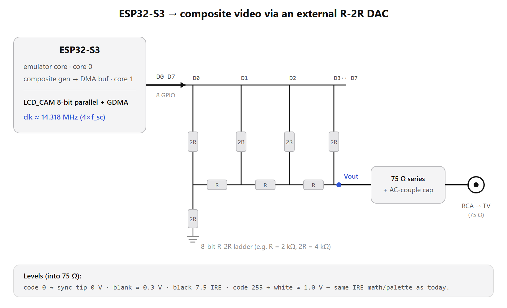

# Future: an ESP32-**S3** composite build ("v2")

**Status: design note / not built.** This captures a hardware+software direction for a future
revision, so the reasoning isn't lost. The current shipping firmware targets the plain **ESP32**
(see the top-level [`CLAUDE.md`](../CLAUDE.md) / [`README.md`](../README.md)).

## Why consider it

The single constraint that has shaped this whole project is the ESP32's **fixed ~128 KB IRAM**.
It's why two emulators can't share one OTA slot, why Stella's 6502 dispatch spills to flash, and
(under DEBUG) why GBC was wrongly written off. IRAM is fixed by the chip — you can't allocate more.

You also **can't escape to a bigger chip without losing composite**, because composite-out here relies
on the ESP32's **built-in DAC** (I2S streams the analog waveform out of GPIO25). The S3/C-series/P4 all
**dropped the DAC**. So the only way to keep cheap composite *and* gain headroom is: move to the **S3**
and generate the analog signal **externally** with an **R-2R resistor ladder**.

The S3 brings three things the plain ESP32 can't:
- **512 KB SRAM (~4× the IRAM headroom)** → multiple emulators co-resident; the IRAM fight disappears.
- **Native USB-OTG host** → read USB-HID gamepads directly, deleting the external CH559 bridge.
- A modern toolchain (IDF 5.x).

The trade is "solder nothing" (built-in DAC) for "~10 resistors + a transistor."

## Signal chain

*(source: [`esp32s3_composite_r2r.svg`](esp32s3_composite_r2r.svg))*

## 1. Composite video via R-2R

The ESP32 path is "I2S → built-in DAC." The S3 replacement is "GDMA → LCD_CAM parallel → R-2R ladder."

- **Peripheral:** the S3's **LCD_CAM** in 8-bit parallel ("i80") mode, fed by **GDMA**, streams 8 GPIOs
  continuously from a DMA buffer at tens of MHz — the jitter-free, CPU-free output the DAC+I2S gave us
  before. The per-scanline ISR / DMA-EOF callback refills the next line's samples (same as now).
- **Clock — the make-or-break detail:** lock the sample rate to **4× the NTSC subcarrier = 14.318 MHz**
  so the colorburst phase is consistent frame-to-frame. Use the **APLL** (as the ESP32 build does) or
  the LCD_CAM fractional divider to hit it. Get this wrong → no color lock / drifting hue (B&W).
- **R-2R ladder (validated values — copy directly):** 8-bit, **R = 160 Ω, 2R = 320 Ω** (build each
  2R as two 160 Ω in series so the 2:1 ratio is exact), **1% metal-film**, 8 GPIOs → ladder.
  - *Why 160 Ω:* to get 1 V across a 75 Ω load from a 3.3 V source the ladder output impedance must be
    `R ≈ (3.3 − 1) × 75 = 2.3 × 75 ≈ 172.5 Ω`; drop to **160 Ω** to absorb the ~40 Ω internal GPIO
    resistance. (This is the [obstruse/pico-composite8](https://github.com/obstruse/pico-composite8)
    ladder — an 8-bit R-2R composite DAC at the same 3.3 V / 75 Ω operating point.)
- **Output stage:** **direct-drive into 75 Ω, no buffer needed.** Ladder out → RCA centre, GND → shield.
  Proven clean **0–1 V** swing; current is tiny (**~6.5 mA worst-case per pin, ~19 mA total**), well
  within S3 pad limits — so the earlier "might need a transistor buffer" caution does **not** apply at
  these values. (Keep a 2N3904 emitter-follower only as a fallback if a particular TV wants stiffer drive.)
- **Levels / code mapping:** sync tip → 0 V, white → ~1 V into 75 Ω. Map the video onto the **full 0–255
  code range** (obstruse uses **sync = 0, black ≈ 86, white = 255**) — this means **recomputing the
  `IRE()` constant**, which is currently calibrated for the ESP32 *internal DAC* (it only uses codes
  ~0–73). The 4-phase Atari palettes, `composite_encode_rgb`, and sync/burst/blit logic otherwise port
  over unchanged — only the output backend and that one scaling constant change.
- **Prior art:**
  - [**obstruse/pico-composite8**](https://github.com/obstruse/pico-composite8) — *the* reference: an
    8-bit R-2R composite DAC (3.3 V → 75 Ω, direct-drive) on an RP2040. Copy the ladder verbatim; the
    Pico's PIO streaming is the analog of the S3's LCD_CAM + GDMA.
  - **bitluni's ESP32Lib** — R-2R *technique* reference, but note his ladders are for **VGA** (0.7 Vpp
    RGB) and his ESP32 **composite was the built-in DAC**, so there's no composite ladder to copy from him.

## 2. USB gamepads — native, no CH559

The plain ESP32 has no USB host (its USB is only the flashing UART bridge), which is why the current
board needs a **CH559** as a USB-HID→UART translator with its own firmware. The S3's **native USB-OTG**
hosts the gamepad directly:

- ESP-IDF **USB Host stack** + **HID class driver** (`usb_host` + `usb_host_hid` / `esp_hid` host role),
  mature in IDF 5.x — read HID reports directly, no bridge protocol.
- **Full-Speed (12 Mbps)** — irrelevant for HID.
- USB on fixed pins **GPIO19/20**.
- Caveats: host must supply **5 V VBUS** to the pad (5 V rail + ideally a load switch); **one port =
  one controller** (USB hub for multiplayer, supported in recent IDF; or a **BLE-HID** pad as a second
  path — BLE only, no Classic BT on S3).

## 3. RAM / IRAM headroom

512 KB SRAM means the active emulator's hot code (and even multiple cores) fit in IRAM with room to
spare. The whole "which functions get `IRAM_ATTR`," "execute spills to flash," and "runtime IRAM
overlay?" discussion **becomes moot** — just place the hot code and move on. Multi-emulator-per-binary
(not just per-OTA-slot) becomes practical.

## 4. Port effort (it's a real port, not a recompile)

- **Toolchain:** S3 needs **IDF 5.x + CMake** (not the legacy IDF 3.3 GNU-Make build used here). The
  emulator cores compile under it; it's a build-system migration.
- **Video backend:** rewrite `components/odroid/video_out.h`'s init/DMA layer for LCD_CAM + GDMA +
  APLL (a few hundred lines). Signal generation carries over.
- **Input:** replace the CH559 UART driver with the USB Host HID driver.
- **Carries over largely intact:** the emulator cores, the composite sample generation, `IRE()`,
  `composite_encode_rgb`, the palettes, the launcher/OTA architecture, save states, the X-menu.

## BOM comparison

| | ESP32 (current) | ESP32-S3 (this design) |
|---|---|---|
| Composite video | built-in DAC (free) | 8-bit R-2R ladder (~16–24 × 160 Ω, no buffer) |
| USB gamepad | external CH559 chip | **native USB host** |
| RAM / IRAM | ~520 KB / ~128 KB | **512 KB SRAM, ~4× IRAM** |
| Multi-emulator per slot | a fight | easy |
| Toolchain | IDF 3.3 (GNU Make) | IDF 5.x (CMake) |

Net: you trade the CH559 for a resistor ladder (~even part count) and gain RAM, native input, and the
end of the IRAM ceiling.

## Open questions / risks to validate first

- Exact LCD_CAM clock setup for a clean 14.318 MHz (APLL vs fractional divider) on the S3.
- ~~R-2R values / buffer~~ **Resolved** — copy obstruse/pico-composite8: 8-bit, R = 160 Ω / 2R = 320 Ω,
  direct-drive, no buffer. Only the **`IRE()` code-mapping constant** still needs recomputing for the
  external 8-bit ladder (target sync = 0, white = 255), verified on a scope.
- USB Host HID driver coverage for the specific gamepads you use (and VBUS power design).
- Re-porting the composite ISR timing to LCD_CAM/GDMA without introducing jitter.
